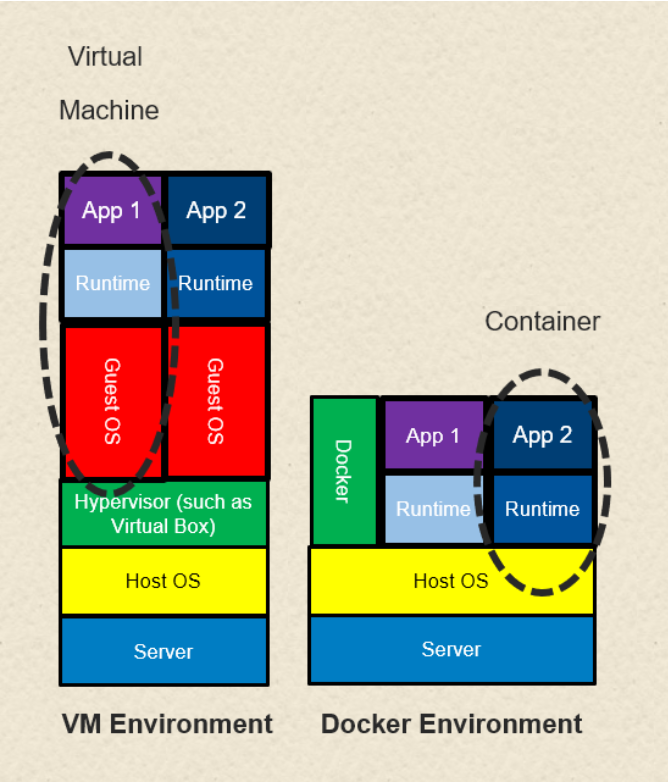
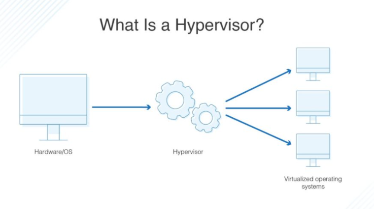
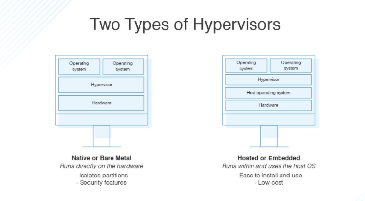
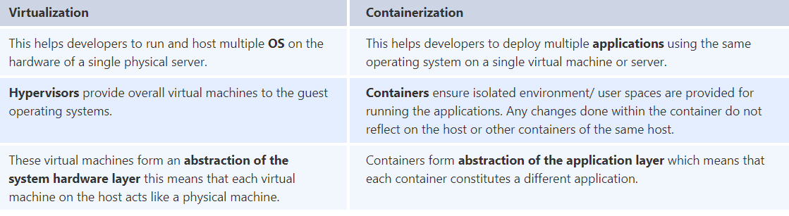
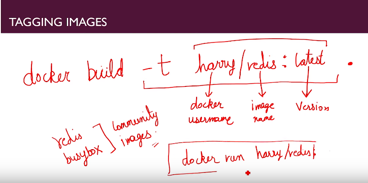

# Docker FAQ

### What is difference between Container and VM?



- For a typical VM to be used, you need a set of technology layers:

  - The host machine and its operating system
  - An application called a hypervisor that is installed on the host, and understands how to load and run the VM from an image file
  - The VM’s environment, including the operating system running within the VM
  - The runtime application and associated environment that run within the VM

- A container doesn't need hypervisor instead it has CRI - container runtime engine which is hosted directly on Host OS
  - CRI's can be docker, podman, cri-o, etc.
  - then the apps runtime
  - apps running on the top

- **diff**
  - Containers and virtual machines are very similar resource virtualization technologies. Virtualization is the process in which a system singular resource like RAM, CPU, Disk, or Networking can be ‘virtualized’ and represented as multiple resources. The key differentiator between containers and virtual machines is that virtual machines virtualize an entire machine down to the hardware layers and containers only virtualize software layers above the operating system level.


###  How to run container with non root user

```text
	FROM alpine:3.8
	RUN adduser -D myuser
	USER myuser
	ENTRYPOINT [“sleep”]
	CMD [“1000”]
```
- Good article to understand non-root user concepts: https://medium.com/better-programming/running-a-container-with-a-non-root-user-e35830d1f42a


### What is Hypervisor?



- A **hypervisor is hardware, software, or firmware capable of creating virtual machines and then managing and allocating resources to them**
- Typically, when you want to replicate a virtual machine, you have to replicate its entire volume manually. Using a hypervisor, you can simply choose which virtual machines and parts you want replicated, and it will perform the process for you
- One of the main benefits of running virtual machines is if one of them crashes, it doesn’t affect the other virtual machines, or the main physical hardware or OS. This is because, although they use the same physical hardware, they’re logically separate from each other
  

### What is namespace in Docker?

- Namespaces are one of Linux Kernel features
- This is one of fundamental aspects for containers on Linux
- Docker uses namespaces to provide isolation to the containers from host.
- Docker Engine uses following namespaces on Linux:

```text
pid: process isolation
NET: namespace for managing network interfaces
IPC: namespace for managing access to IPC resources
MNT: For managing filesystem mount points
UTS: isolating kernel and version identifiers.
User Id namespace for privilege isolation.
```

- Docker uses a technology called namespaces to provide the isolated workspace called the container. When you run a container, Docker creates a set of namespaces for that container. These namespaces provide a layer of isolation.

- See example for modifying ns [here](notes/2_hacking/2.4.0_modyfying_shared_files_with_root_access.md)

### Explain CGGroup

- A Linux Kernel feature that allows you to limit the access processes and containers have to system resources such as CPU, RAM, IOPS and network.
- its one of fundamental aspects of Docker Container
- Example [here](notes/2_hacking/2.5.0_limit_cggroups.md)


### What can you tell about Docker Compose?
- It is a YAML file consisting of all the details regarding various services, networks, and volumes that are needed for setting up the Docker-based application. So, docker-compose is used for creating multiple containers, host them and establish communication between them.


### difference between save/load and export/import
- The difference between save/load and export/import is that the first one works with images including metadata, but the export/import combination uses only container layers and doesn't include any image metadata information such as name, tags, and so on. In most cases, the save/load combination is more relevant and works properly for images without special needs

- The docker save command packs the layers and metadata of all the chains required to build the image. You can then load this saved images chain into another Docker instance and create containers from these images.
### Differentiate between virtualization and containerization.



### Can you tell the difference between CMD and ENTRYPOINT?

-  CMD sets default command and/or parameters, which can be overwritten from command line when docker container runs. ENTRYPOINT command and parameters will not be overwritten from command line. Instead, all command line arguments will be added after ENTRYPOINT parameters

- The most commonly used ENTRYPOINT is /bin/sh or /bin/bash for most of the base images.

### Differentiate between COPY and ADD commands that are used in a Dockerfile?

- COPY provides just the basic support of copying local files into the container whereas **ADD provides additional features like remote URL and tar extraction support.**
- Both the commands have similar functionality, but **COPY is more preferred because of its higher transparency level** than that of ADD

### How to tag Docker images:


### What is Docker tag?

```text
docker tag SOURCE_IMAGE[:TAG] TARGET_IMAGE[:TAG]
```
- Docker tags are the kind of identifiers that Docker attaches to the layers and ultimately to the image and container.
- Although the :TAG part can be any string you want, it is usually set to a string or set of numbers that identifies the version of the named item - for example “ubuntu:lucid” or “ubuntu:12.04”.
- Docker supports a default tag named “latest”.  That means if you don’t supply the :TAG part of an image identifier, Docker will automatically set it to “latest” as in “ubuntu:latest”.

### Explain Docker configuration

- Docker daemon configuration is managed by the Docker configuration file (/**etc/docker/daemon.json**) and Docker daemon startup options are usually controlled by the systemd unit named Docker.
- On Red Hat-based operating systems, some configuration options are available at /etc/sysconfig/docker and/etc/sysconfig/docker-storage.
- Modification of the mentioned file will allow you to change Docker parameters such as the UNIX socket path, listen on TCP sockets, registry configuration, storage backends, and so on

### how images are retrieved from registry:

	• Whenever we write command to Docker client it talks to server and get response. 
	• Docker server search for image locally ( in local cache) and if  retrieve from there.
	• IF no image on local, it checks on docker hub or other configured repository.
	• Download image from docker hub and store in local cache.
	• Create container from that image. 
	• Start container.

### How containers Communicate?
- check [here](1.11.0_Docker_Networking.md) and [here](1.11.1_how_containers_communicae.md)