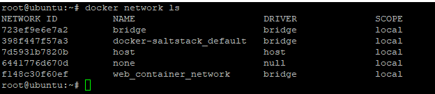

# Docker Networking Concepts


#### Explain how Docker networking works: 


- When we actually starts a container, each container is connected to pvt virtual network called "bridge
- We can create our own network also like "Net-myapp" created in above diagram
- **Each virtual networks route through NAT firewall on host IP** which is docker daemon configuring host IP address on its interface so that container can get out to the interface to talk to rest of world and get back.
- All containers on same bridge or virtual network can talk to each other without -p.( C1 and C2 container which is part of same network above can talk freely without port.  But when C1 needs to talks to outside world it has to go through port 80 of host interface ( ethernet) only.
- Best practice is to create new virtual network for each related app
- Most defaults settings of containers are easily configurable
- **we can attach container to more than one virtual network.**
- we can also skip virtual network and use host IP ) --net=host)

#### How to know IP of running container:


### how to list all networks: 


- bridge:Default Docker Virtual N/w which is NATed behind the host IP.
- host:it gains performance by skipping virtual network but compromises security or container model. 
- none : removes eth0 and only leaves you with localhost interface in container.
  
### How DNS is key to inter container communication

- Containers IP's not constant as its keep getting created and destroyed, recreated etc.
-  so we can't rely on IP address of container 
- solution to above is DNS naming 
- Docker Daemon has built in DNS server that container uses by default
- when we create new network its associated with default "bridge" driver. its simple driver which creates virtual network locally with its own subnet

- We can also have external network drivers associated to it which will give additional virtual network features. 

```text
docker container run -d -name mynginx_container --network  web_container_network nginx 
```
- containers in same network can connect but in different network cannot connect
- create 3 containers: 
```text
docker container run --name mynginx1 -d -p 80:80 --network web_container_network nginx:alpine
docker container run --name mynginx2 -d -p 8080:80 --network web_container_network nginx:alpine
docker container run --name mynginx_other -d -p 8081:80  nginx:alpine
```
- So Same bridge ping works but different virtual network ping doesn't work.


**Note**: Default network doesn't have DNS server associated to it by default. So when we create new container in default network we need to use --link with create option so that two containers in default network can talk to each other.
New network created by user will have default DNS while default network doesn't have it.


### 

###

###


###

###

###

###

###

###

