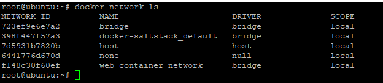

# How containers Communciate:

- All containers on same bridge or virtual network can talk to each other without -p.( C1 and C2 container which is part of same network above can talk freely without port. 
- But when C1 needs to talks to outside world it has to go through port 80 of host interface ( ethernet) only.


### How DNS is key to inter container communication

- Containers IP's not constant as its keep getting created and destroyed, recreated etc.
-  so we can't rely on IP address of container
- solution to above is DNS naming
- Docker Daemon has built in DNS server that container uses by default
- when we create new network its associated with default "bridge" driver. its simple driver which creates virtual network locally with its own subnet
  
- We can also have external network drivers associated to it which will give additional virtual network features.

```text
docker container run -d -name mynginx_container --network  web_container_network nginx 
```
- containers in same network can connect but in different network cannot connect

- create 3 containers:
- mynginx1 and myngin3 in same network: web_container_network
- mynginx2 in differnt default network: bridge


```text
docker container run --name mynginx1 -d -p 8080:80 --network web_container_network nginx:alpine

docker container run --name mynginx2  -d -p 8081:80  nginx:alpine

docker container run --name mynginx3 -d -p 8082:80 --network web_container_network nginx:alpine
```
- Ping works between mynginx1 and mynginx3:
```text
[root@dockervmfree ~]# docker exec -it mynginx1 ping mynginx3
PING mynginx3 (172.18.0.2): 56 data bytes
64 bytes from 172.18.0.2: seq=0 ttl=64 time=0.114 ms
64 bytes from 172.18.0.2: seq=1 ttl=64 time=0.127 ms
64 bytes from 172.18.0.2: seq=2 ttl=64 time=0.101 ms
64 bytes from 172.18.0.2: seq=3 ttl=64 time=0.093 ms
64 bytes from 172.18.0.2: seq=4 ttl=64 time=0.177 ms
64 bytes from 172.18.0.2: seq=5 ttl=64 time=0.128 ms
64 bytes from 172.18.0.2: seq=6 ttl=64 time=0.104 ms
64 bytes from 172.18.0.2: seq=7 ttl=64 time=0.124 ms
64 bytes from 172.18.0.2: seq=8 ttl=64 time=0.116 ms
^C
--- mynginx3 ping statistics ---
9 packets transmitted, 9 packets received, 0% packet loss

```

- ping fails between mynginx1 and mynginx2:

```text
[root@dockervmfree ~]# docker exec -it mynginx1 ping mynginx2
ping: bad address 'mynginx2'

```
- So Same bridge ping works but different virtual network ping doesn't work.

**Note**: Default network doesn't have DNS server associated to it by default. So when we create new container in default network we need to use --link with create option so that two containers in default network can talk to each other.
New network created by user will have default DNS while default network doesn't have it.

- create another container `mynginx4` in another network `web_container_network_4`
```text
docker container run --name mynginx4 --network=web_container_network_2 -d -p 8084:80 nginx:alpine
```

- it fails to connect with `mynginx1` as expected since both in diff network
- to be continued ....
- https://medium.com/edureka/docker-networking-1a7d65e89013
- 
