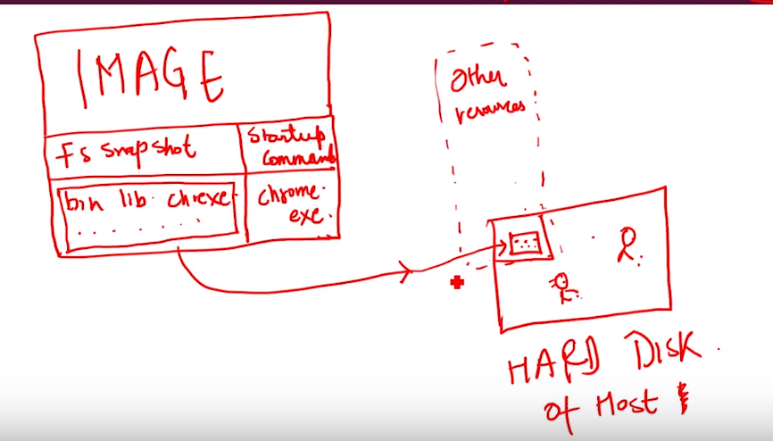
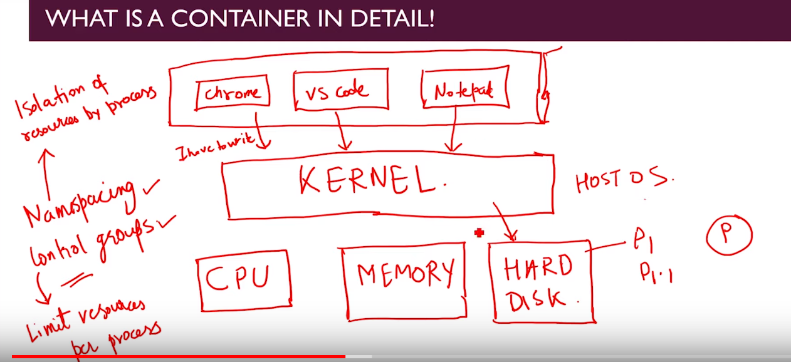
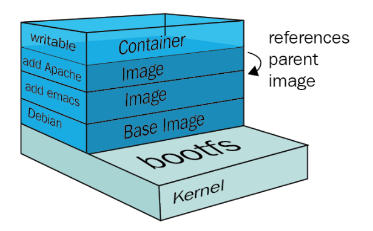
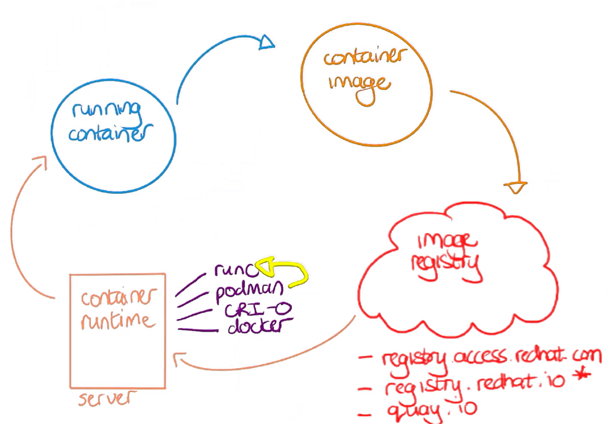

# Docker Concepts

### what is image-

- its a software piece with its own set of resources- cpu, disk etc.
- A image usually consists of several layers, stacked one on top of the other. 
- **Layers in an image are read-only and images can share layers between them.**
- Image will basically consist of 2 things: 
  -  **File System Snapshot** 
  -  **StartUp Command**
- its like seed which will grow into tree (called Container)

**Example**: 

- Chrome is set of file stored somewhere in hard disk hence its basically file system snapshot.
- So image just contains file system snapshot and start-up command. 
- When docker uses this image to convert to container it just replaces file system snapshot into part of OS hard disk allocated to Container. 
- Also, Kernel allocates other resources required by container. 
- Finally, it will run start-up command which default comes with image only.  
- But we can overwrite this start-up command when launching container.

- To create a container, a thin read-write layer is added on top of an image’s layers.
- Once an image is available, the Docker command “run” can be used to create a container from an image.  
- The run operation adds a thin, writable layer onto the image layers.  **This added layer is where any new content or changes can be placed while still retaining all of the pieces that have been installed and configured in the read-only layers of the underlying image.**

- **And, because images are read-only and containers just add a layer on top of the image, multiple containers can be created based on the same image.**

### what is container?
- Container is basically running instance of container image, it consists of 
  - an isolated environment
  - part of hard disk allocated to it
  - have its own resources CPU, MEM etc.
- **thus when resouces are allocated to image it turns into container**

- Kernel is heart of Operating System and has full rights on management of key resources - CPU ; MEMORY; HARD DISK.
- So When different apps viz. chrome, VS code, notepad++ ask for resources kernel decides who will get it and in what order.
- There are two key components which helps kernel to manage these resources:
  - **Name spacing**: This is isolation of resources by process
  - **Control Groups(cggroup)**: Limit resources per process. 
- If Chrome requires program P1 and VS Code requires P1.1 then only one app would run here.

- Now Container is process which will have its own hard disk, memory and CPU which is part of hosted OS. Docker helps in  facilitating this process called container.

- The container filesystem, used for every Docker image, is represented as a list of read-only layers stacked on top of each other. These layers eventually form a base root filesystem for a container. 
- In order to make it happen, different storage drivers are being used. All the changes to the filesystem of a running container are done to the top level image layer of a container. This layer is called a **Container layer**

## Lifecycle of container:

- if our objective is running container, we need to have container image
- container image we get from container registry (trusted sources)
  - docker registry
  - quay.io ( pronounced kee.io)
  - azure registry 
  - redhat registry
- next we need is server computed to run container
  - server - physical or virtual machine
  - this is where container runtime is installed
  - **example**
    - runc -> extrmenly lightweight container runtime
    - podman -> simple easier version of runc
    - crio-o -> used by openshift and kubernetes
    - docker -> another container runtime

- so our server where container runtime is installed will download the image from container registry and instantiate the container for us.

- also there is something called OCI, more on OCI [here](1.2.1_Dcoker_OCI.md)

