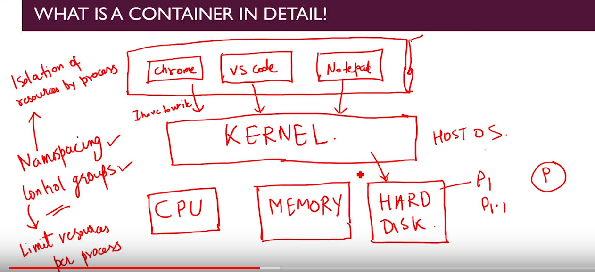
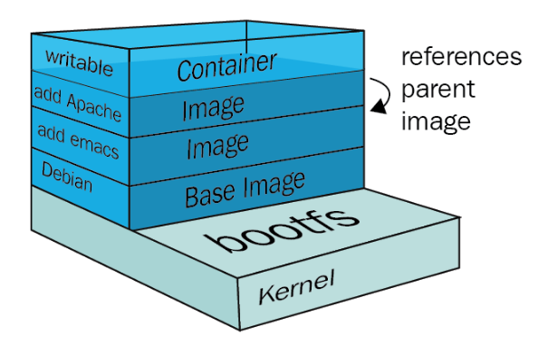
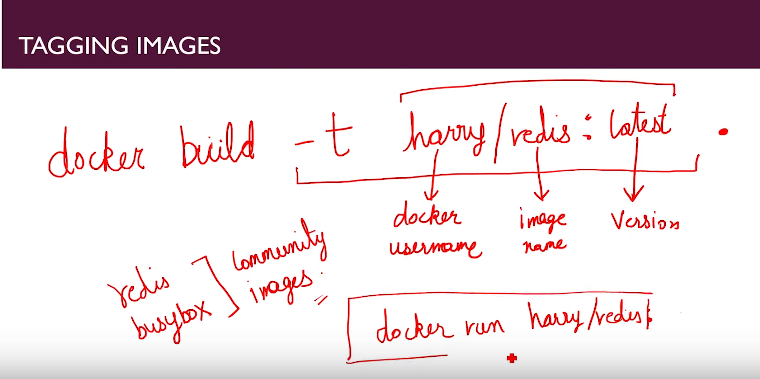

# Docker Concepts


### what is image-

- A Docker image usually consists of several layers, stacked one on top of the other. 
- Layers in an image are read-only and images can share layers between them.
- Image will basically consist of 2 things: (1) **File System Snapshot** (2) **StartUp Command**
- its like seed which will grow into tree (called Container)
- software piece with its own set of resources- cpu, disk etc.,.


Example: 

- Chrome is set of file stored somewhere in hard disk hence its basically file system snapshot.
- So image just contains file system snapshot and start-up command. 
- When docker users this image to convert to container it just replaces file system snapshot into part of OS hard disk allocated to Container. 
- Also, Kernel allocates other resources required by container. 
- Finally, it will run start-up command which default comes with image only.  
- But we can overwrite this start-up command when launching container.

- To create a container, a thin read-write layer is added on top of an image’s layers.
- Once an image is available, the Docker command “run” can be used to create a container from an image.  
- The run operation adds a thin, writable layer onto the image layers.  **This added layer is where any new content or changes can be placed while still retaining all of the pieces that have been installed and configured in the read-only layers of the underlying image.**

- **And, because images are read-only and containers just add a layer on top of the image, multiple containers can be created based on the same image.**

### what is container?
- an isolated environment
- part of hard disk allocated to it
- have its own resources CPU, MEM etc.
- When we allocate resources to image it turns to container



- Kernel is heart of Operating System and has full rights on management of key resources - CPU ; MEMORY; HARD DISK.
- So When different apps viz. chrome, VS code, notepad++ ask for resources kernel decides who will get it and in what order.
- There are two key components which helps kernel to manage these resources:
  - **Name spacing**: This is isolation of resources by process
  - **Control Groups(cggroup)**: Limit resources per process. 
- If Chrome requires program P1 and VS Code requires P1.1 then only one app would run here.

- Now Container is process which will have its own hard disk, memory and CPU which is part of hosted OS. Docker helps in  facilitating this process called container.

- The container filesystem, used for every Docker image, is represented as a list of read-only layers stacked on top of each other. These layers eventually form a base root filesystem for a container. 
- In order to make it happen, different storage drivers are being used. All the changes to the filesystem of a running container are done to the top level image layer of a container. This layer is called a **Container layer**




### What is namespace in Docker?

- Namespaces are one of Linux Kernel features
- This is one of fundamental aspects for containers on Linux
- Docker uses namespaces to provide isolation to the containers from host.
- Docker Engine uses following namespaces on Linux:

```text
pid: process isolation
NET: namespace for managing network interfaces
IPC: namespace for managing access to IPC resources
MNT: For managing filesystem mount points
UTS: isolating kernel and version identifiers.
User Id namespace for privilege isolation.
```

- Docker uses a technology called namespaces to provide the isolated workspace called the container. When you run a container, Docker creates a set of namespaces for that container. These namespaces provide a layer of isolation.

- See example for modifying ns [here](notes/2_hacking/2.4.0_modyfying_shared_files_with_root_access.md)

### Explain CGGroup

- A Linux Kernel feature that allows you to limit the access processes and containers have to system resources such as CPU, RAM, IOPS and network.
- its one of fundamental aspects of Docker Container
- Example [here](notes/2_hacking/2.5.0_limit_cggroups.md)

### What is Docker tag?

```text
docker tag SOURCE_IMAGE[:TAG] TARGET_IMAGE[:TAG]
```
- Docker tags are the kind of identifiers that Docker attaches to the layers and ultimately to the image and container.
- Although the :TAG part can be any string you want, it is usually set to a string or set of numbers that identifies the version of the named item - for example “ubuntu:lucid” or “ubuntu:12.04”.
- Docker supports a default tag named “latest”.  That means if you don’t supply the :TAG part of an image identifier, Docker will automatically set it to “latest” as in “ubuntu:latest”.

### How to tag Docker images:


### Docker configuration

- Docker daemon configuration is managed by the Docker configuration file (/**etc/docker/daemon.json**) and Docker daemon startup options are usually controlled by the systemd unit named Docker.
- On Red Hat-based operating systems, some configuration options are available at /etc/sysconfig/docker and/etc/sysconfig/docker-storage. 
- Modification of the mentioned file will allow you to change Docker parameters such as the UNIX socket path, listen on TCP sockets, registry configuration, storage backends, and so on

### how images are retrieved from registry:

	• Whenever we write command to Docker client it talks to server and get response. 
	• Docker server search for image locally ( in local cache) and if  retrieve from there.
	• IF no image on local, it checks on docker hub or other configured repository.
	• Download image from docker hub and store in local cache.
	• Create container from that image. 
	• Start container.
