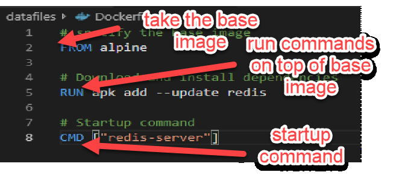
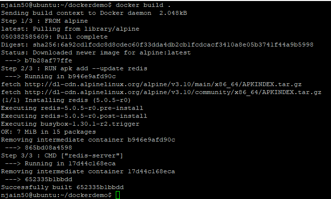
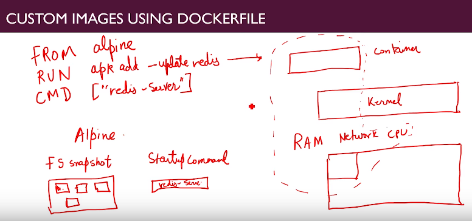

# Dockerfile

### Explain Simple Dockerfile

https://docs.docker.com/engine/reference/builder/

- Dockerfile talks to docker client  which talk to Docker server and docker server will create a usable image.

- Basic structure of Dockerfile is as follows:
  

**Explanation**: 

```text
(1)FROM - its normally a minimal distribution on top of which your image is built.

(2)ENV - way to set environment variables, keys-values etc.

(3)RUN - commands to run, followed by && since it will run as one command and hence save space. With && each command will run in one single layer and save space.We can have multiple run commands

(4)EXPOSE - by default no tcp/udp ports are open. expose doesn't mean ports are open automatically. we still need to specify -p.

(5)CMD : final command will be run every time we launch new container. If no CMD or ENTRYPOINT is specified it will inherit CMD of FROM image specified in Dockerfile.
```


- You can build image from Dockerfile as follows:



- Following pic shows what actually happening behind the scene:




