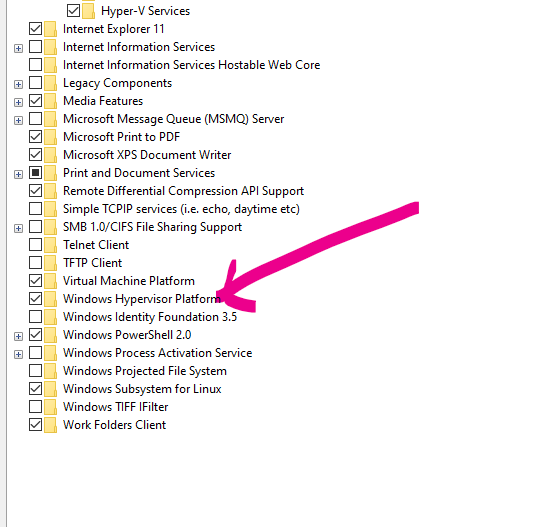
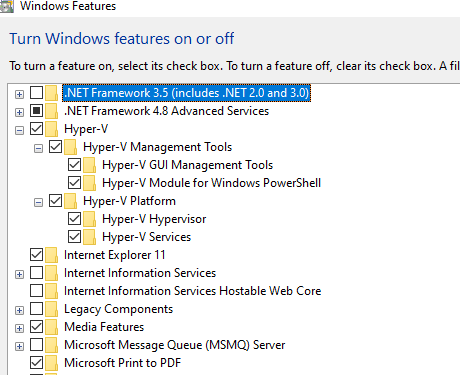
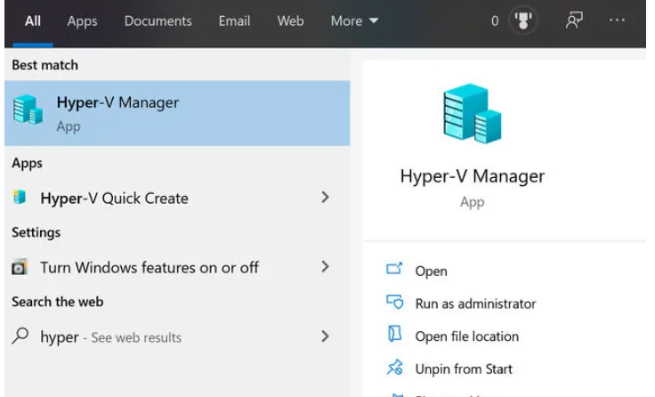

# Virtualization Concepts 

## What is Virtualization?

- Virtualization is a process that allows for **more efficient utilization of physical computer** hardware and is the foundation of cloud computing.
- **Virtualization uses software to create an abstraction layer over computer hardware that allows the hardware elements of a single computer—processors, memory, storage and more—to be divided into multiple virtual computers, commonly called virtual machines (VMs).**
- Each VM runs its own operating system (OS) and behaves like an independent computer, even though it is running on just a portion of the actual underlying computer hardware.
- Today, virtualization is a standard practice in enterprise IT architecture. It is also the **technology that drives cloud computing economics**


## Who provides Virtualization Solutions:

- There are many companies in market who offer virtualization solutions depending on specific scenario:
  - **VMware**, which specializes in server, desktop, network, and storage virtualization
  - **Citrix**, which has a niche in application virtualization but also offers server virtualization and virtual desktop solutions;
  - **Microsoft, whose Hyper-V** virtualization solution ships with Windows 
    - Hypervisors take the physical resources and separate them so they can be utilized by the virtual environment.
    - It serves as an interface between the VM and the underlying physical hardware, ensuring that each has access to the physical resources it needs to execute.
    - more on it [here](https://www.ibm.com/in-en/cloud/learn/hypervisors)
    - also [here](https://www.ibm.com/in-en/cloud/learn/virtualization-a-complete-guide)

## Hyper-V

- Hyper-V is Microsoft’s virtualization platform.
- the Hyper-V feature is only available in Windows 10 Professional and Enterprise editions. You can’t install it on Windows 10 Home Edition by default.
- to install Hyper-V to windows 10 home editon:

- in case you are running `minikube start` and getting following error:
```text
 Hyper-V PowerShell Module is not available error when module is installed
```
- And same we can also confirm by following: 
- go to turn on windows features and Hyper-V missing:


- only `Windows HyperVisor Platform` is there, find comparision here:
```text

- Hyper-V is Microsoft’s hypervisor that lets you run full versions of other operating systems from Linux and Microsoft inside your current machine

- Virtual Machine Platform is a less powerful version of HyperV that still enables a hypervisor, Windows Hypervisor Platform lets virtualized applications (like AppV applications) to run in your Windows without requiring the full HyperV hypervisor

- Windows Sandbox is a very cool feature that lets you run a temporary version of Windows inside your current Windows.  It’s use cases are like “In Private Browsing” or “Incognito Mode” in Chrome and Edge browsers, in that by default nothing you do inside those protected shells stays on your computer when you shut it down. VMP is a requirement for WSL2.
- Windows Subsystem For Linux is just what is says.  It allows you to run Linux commands inside your Windows.

```
- follow below steps to install hyper-V on your Windows OS:

- run `systeminfo` to check your Windows editon:
```text
:\Users\offic>systeminfo

Host Name:                 DESKTOP-N38RJ75
OS Name:                   Microsoft Windows 10 Home
OS Version:                10.0.19044 N/A Build 19044
OS Manufacturer:           Microsoft Corporation
OS Configuration:          Standalone Workstation
OS Build Type:             Multiprocessor Free
```
- create bat file - Hyper-V-Enabler.bat , with following command:
```text
pushd "%~dp0"
dir /b %SystemRoot%\servicing\Packages\*Hyper-V*.mum >hyper-v.txt
for /f %%i in ('findstr /i . hyper-v.txt 2^>nul') do dism /online /norestart /add-package:"%SystemRoot%\servicing\Packages\%%i"
Dism /online /enable-feature /featurename:Microsoft-Hyper-V -All /LimitAccess /ALL
pause
```
- right click the file and run as Admin and press `Y` at end to restart
- this will install Hyper-V on your machine
- go to Windows Features on/off section and you will find its now installed on your machine:



- You can search for Hyper-V in the start menu to start creating virtual machines on your Windows 10 Home computer.



## Disable Hyper-V from Windows 10 Home
- if you don’t want this functionality in your computer, you can always disable it. There are two ways to disable:

- Go to Run –> optionalfeatures. 
- This will open the Optional Features window.
  - Uncheck Hyper-V and Hyper-V management tools.
  - Restart the computer.
  - You can also do this using the powershell: `Disable-WindowsOptionalFeature -Online -FeatureName Microsoft-Hyper-V -All`
  - or from command prompt `DISM /Online /Disable-Feature /All /FeatureName:Microsoft-Hyper-V`